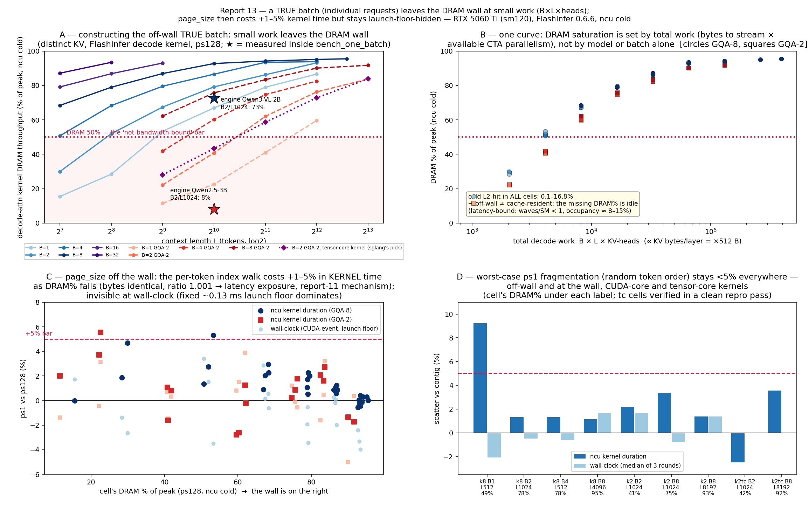

# Work-aware FlashInfer decode dispatch for SGLang — implementation & PR plan

**Status:** RFC + implementation design, evidence-complete on one consumer GPU (2 drivers); **not yet
file-ready** — an on-by-default change requires the datacenter/CUDA-graph validation in §10 first. This
document is written so that the moment the H100 numbers exist, the PR can be opened against
`python/sglang/srt/layers/attention/flashinfer_backend.py` verbatim.

**Target file:** [`python/sglang/srt/layers/attention/flashinfer_backend.py`](python/sglang/srt/layers/attention/flashinfer_backend.py) (upstream `main` @ `947a14d`, FlashInfer pinned `flashinfer_python[cu13]==0.6.14`).

**Author / provenance:** derived from the RTX 5060 Ti (sm120) profiling study "Report 13" (Chuyue Wang, PI
Jiaheng Lu). Every number in §4 was **re-derived from the raw ncu CSVs and `bench_one_batch` JSONL** committed
in `sglang_log/offline_batch_results/offwall_profile/` and `.../bench_one_batch_offwall_5060ti/` by
[`pr_workaware_decode/parse_ncu_evidence.py`](pr_workaware_decode/parse_ncu_evidence.py) — not transcribed from
the report prose.

---

## 0. TL;DR

SGLang decides *once, at attention-backend construction*, whether decode uses FlashInfer's tensor‑core
(prefill‑template MMA) kernel, purely from static model shape:
[`should_use_tensor_core()`](python/sglang/srt/layers/attention/flashinfer_backend.py#L2159) returns
`gqa_group_size >= 4` for bf16/fp16. **There is no batch/context/work term anywhere in the decode dispatch or
in the split‑KV plan** (in the normal, non‑deterministic path SGLang passes `fixed_split_size=None` and lets
FlashInfer's scheduler pick the split). At small, "agentic" decode operating points — low batch × moderate
context, i.e. total work `B·L·kv_heads` too small to fill the SMs — this work‑blindness leaves the decode
attention kernel **off the DRAM bandwidth wall** and, on some driver/plan combinations, produces a
pathological **KV‑split over‑split** (2 launches/layer + a serial `merge_states`) that runs the per‑layer
attention several‑fold slower than a single‑launch plan.

**What this PR does (recommended, primary):** make the FlashInfer **decode KV‑split occupancy‑aware** — mirror
the existing, proven Triton‑backend heuristic ([`get_num_kv_splits_triton`](python/sglang/kernels/ops/attention/metadata.py#L11))
so the decode grid targets ≈ one SM‑wave (`grid ≈ num_sm`), passed to FlashInfer via the already‑plumbed
`fixed_split_size`. Behind an env flag, default off. This targets the **actual measured root cause**, needs
**zero new wrappers and zero extra CUDA‑graph memory**, and cannot change numerics beyond FlashInfer's own
documented split‑reduction order. It is **work‑exact in eager mode** (real `L`) and a **per‑`bs` capture‑time
proxy under CUDA graphs** (real `L` is unavailable at capture — a graph invariant, §7.1).

**What this PR also offers (secondary, the literal "add a work term to `should_use_tensor_core`" ask):** an
optional work‑aware *kernel‑class* gate that routes below‑occupancy decode to the CUDA‑core `BatchDecode`
kernel. It is fully specified in §7.2, but it is **not the recommended lever** — the evidence (§4.4) shows the
tensor‑core kernel is *not* the problem (it is marginally faster than CUDA‑core even at the target cell), it
carries a documented accuracy‑regression history (§5, PR #1511 / FlashInfer #2896), and under CUDA graphs it
can only be a coarse `bs·kv_heads` proxy. Ship it off by default, experimental.

**Honest scope:** end‑to‑end TPOT is *unchanged* for the small models measured (attention is ≈1–2 % of the
decode step; weights dominate). The win is **attention‑kernel time and plan determinism in the off‑wall
regime**, not throughput. Do not oversell it. The one‑consumer‑GPU/two‑driver evidence is sufficient to
motivate and design, **not** to default‑enable — see the validation gate and kill criteria in §10.

---

## 1. Where the decision lives today (source‑verified)

All line numbers are upstream `main` @ `947a14d`.

### 1.1 The static decision
```python
# flashinfer_backend.py:2159
def should_use_tensor_core(kv_cache_dtype, num_attention_heads, num_kv_heads) -> bool:
    env_override = os.environ.get("SGLANG_FLASHINFER_USE_TENSOR_CORE")   # :2176 escape hatch
    if env_override is not None:
        return env_override.lower() == "true"
    ...
    gqa_group_size = num_attention_heads // num_kv_heads                 # :2196
    if kv_cache_dtype in (torch.float8_e4m3fn, torch.float8_e5m2):
        return True
    elif kv_cache_dtype in (torch.float16, torch.half, torch.bfloat16):
        return gqa_group_size >= 4                                      # :2203  ← work‑blind rule
    else:
        return False
```
Inputs are **all static** (dtype, per‑TP head counts). Comment at `:2198‑2199`: *"a GQA group size of at least
4 is needed to efficiently use Tensor Cores, as it fuses the head group with the token dimension in MMA."* (Note:
the `>=4` threshold and the MMA‑fusion phrasing are **SGLang's own**; FlashInfer's `BatchDecodeWithPagedKVCacheWrapper`
docstring only says tensor cores are *"faster for large group size"* — it does not document a numeric threshold.)

### 1.2 The result is baked into the wrapper at construction
```python
# flashinfer_backend.py:325   (computed once)
self.decode_use_tensor_cores = should_use_tensor_core(kv_cache_dtype=..., num_attention_heads=..., num_kv_heads=...)
# :373   (forced True only for enable_deterministic_inference)
# :469   eager decode wrapper:      BatchDecodeWithPagedKVCacheWrapper(..., use_tensor_cores=self.decode_use_tensor_cores)
# :919   cuda‑graph decode wrapper: same, inside _create_decode_wrappers(bs, num_tokens)
```
`use_tensor_cores` is a **constructor argument** — it cannot be changed after the wrapper exists. A per‑forward
kernel‑class switch therefore needs **two coexisting decode wrappers**; the *split* knob (below) does not.

### 1.3 The split‑KV knob — plumbed, but static (and unused in the normal path)
```python
# flashinfer_backend.py:202/290‑291   plan() args tail:  fixed_split_size (default -1), disable_split_kv=False, num_colocated_ctas=0
# :378   decode_split_tile_size = SGLANG_FLASHINFER_DECODE_SPLIT_TILE_SIZE (default 2048) — SET ONLY under enable_deterministic_inference (:366‑381)
# :796   eager decode plan:        fixed_split_size=self.decode_split_tile_size (None in the normal path), disable_split_kv=False
# :683‑684  cuda‑graph decode replay: fixed_split_size=None, disable_split_kv=self.disable_cuda_graph_kv_split
```
**Key fact (grounding‑verified):** outside deterministic inference, `self.decode_split_tile_size is None`, so
the normal decode path passes `fixed_split_size=None` → **FlashInfer's C++ scheduler chooses the split count**.
The over‑split pathology in §4 is thus *FlashInfer's* work‑unaware decision; this PR has SGLang *override* it at
small work, exactly as the Triton backend already overrides its own split count.

### 1.4 Where per‑forward work is available
- **Eager** — [`init_forward_metadata()` decode branch](python/sglang/srt/layers/attention/flashinfer_backend.py#L787): has `forward_batch.seq_lens`, `seq_lens_cpu`, `seq_lens_sum`, and `len(req_pool_indices)` = batch size. **Real `L`, work‑exact.**
- **CUDA‑graph** — [`init_forward_metadata_out_graph()`](python/sglang/srt/layers/attention/flashinfer_backend.py#L646) re‑runs the decode plan out‑of‑graph with the **real** `seq_lens` (via `fast_decode_plan`) to refresh indices, but the **launch grid — and therefore the KV‑split CTA count — is fixed at capture** (a CUDA‑graph invariant), where `seq_lens` is the sentinel fill value (1, `:1106`). So *both* the kernel class and the split grid are effectively decided at capture with only `bs`/`kv_heads` known; real `L` is not. This is why the deterministic path sets the graph split via `disable_split_kv` **at capture** (`:684`), not a per‑replay `fixed_split_size`. See §7.1 for the capture‑time (per‑`bs`) option and the one FlashInfer‑internal fact to verify.
- `num_sm` is already read in this very file: [`torch.cuda.get_device_properties(device).multi_processor_count`](python/sglang/srt/layers/attention/flashinfer_backend.py#L995).

The whole design turns on this: **the split lever is work‑exact in eager and a per‑`bs` capture‑time proxy under
graphs (no extra graphs); the kernel‑class lever is per‑`bs` at best and needs a second wrapper.** Both are
`bs`‑keyed under graphs — but the split lever's failure mode (a slightly non‑optimal split) is far milder than
the kernel‑class lever's (a frozen wrong kernel + numerical risk).

---

## 2. Prior art — is this already done? (searched sgl-project/sglang + flashinfer-ai/flashinfer)

**No one has added a work/batch term to `should_use_tensor_core` or made the FlashInfer decode split
occupancy‑aware.** The change is novel and non‑duplicative. Closest hits:

| # | Repo | Title | Status | Relation |
|---|------|-------|--------|----------|
| [#8624](https://github.com/sgl-project/sglang/pull/8624) | sglang | Use Tensor Core Decode when gqa group size ≥ 4 | merged | **The exact code we revise.** Motivated by serving‑load ITL (Llama‑3‑8B); no work term. Cite as the baseline. |
| [#2179](https://github.com/sgl-project/sglang/pull/2179) | sglang | add `should_use_tensor_core` | merged | Origin of the function. |
| [#1511](https://github.com/sgl-project/sglang/pull/1511) | sglang | Revert "use tensor cores for flashinfer gqa kernels" | merged | Reverted an earlier TC‑for‑GQA attempt for **accuracy** regression on Llama‑3.1‑70B humaneval → **mandates an accuracy gate.** |
| [#27786](https://github.com/sgl-project/sglang/pull/27786) | sglang | [Triton] Fix low‑batch long‑context decode occupancy: context‑gated KV‑splits cap | **open** | **Sibling.** Same under‑parallelization thesis, Triton backend, gates KV‑splits. Ours is the FlashInfer analog. Cross‑reference. |
| [#10645](https://github.com/sgl-project/sglang/pull/10645)/[#26412](https://github.com/sgl-project/sglang/pull/26412) | sglang | Deterministic inference / forward `fixed_split_size` | merged | Wired the `fixed_split_size` / `SGLANG_FLASHINFER_DECODE_SPLIT_TILE_SIZE` lever we reuse. |
| [#1343](https://github.com/flashinfer-ai/flashinfer/issues/1343) | flashinfer | fuse GQA group into TC tile | closed | The "why" behind `group≥4 → TC`. |
| [#520](https://github.com/flashinfer-ai/flashinfer/issues/520) | flashinfer | TC True vs False nearly identical (H100 MHA) | open | **Supports honesty:** intrinsic TC‑vs‑CUDA‑core gap is small/ambiguous. |
| [#2066](https://github.com/flashinfer-ai/flashinfer/issues/2066) | flashinfer | Attention long idle time (200µs idle in 650µs kernel) | open | Independent field report of the exact off‑wall / low‑occupancy symptom. |
| [#2896](https://github.com/flashinfer-ai/flashinfer/issues/2896) | flashinfer | TC decode degenerate output, group_size=7 bf16 | open | Reinforces #1511: kernel‑class switch has numerical risk. |

Takeaway: `should_use_tensor_core` is the **odd one out** — a static, work‑free decision — while the codebase's
own decode precedent (`get_num_kv_splits_triton`, `metadata.py:11`; `_mla_decode_kv_splits_cap`,
`triton_backend.py:67`) already does occupancy‑aware, GQA‑aware, per‑forward split reasoning. **We port that
pattern to FlashInfer.**

---

## 3. The defect, precisely

At a decode operating point where total work `B·L·kv_heads` is small, a paged decode‑attention kernel emits
few CTAs relative to the SM count. The base (unsplit) decode grid is ≈ `B · num_kv_heads` (one CTA per
`(request, kv_head)`, the GQA group folded into the MMA tile). When that is `≪ num_sm`, the machine is
under‑parallelized (waves/SM ≪ 1), HBM idles, and the kernel is **latency/launch‑bound, not
bandwidth‑bound**. This is standard roofline behavior and is independently reported for FlashInfer attention
(flashinfer #2066) and for batch‑1 decode generally ([arXiv:2605.30571](https://arxiv.org/abs/2605.30571):
H100 reaches only 27 % of its bandwidth floor at batch‑1).

FlashInfer's remedy for under‑parallelization is **split‑KV**: cut each request's KV range into `S` chunks to
manufacture `B · num_kv_heads · S` CTAs, then a `merge_states` kernel reduces the partials. But the split count
is chosen **work‑unaware**. Two failure modes, both consequences of the same blindness, and *opposite in sign*:

- **Under‑split** (too few CTAs) — the FA‑3 / Hopper low‑head‑count case documented by
  [arXiv:2604.00028](https://arxiv.org/abs/2604.00028): the split heuristic disables splitting by sequence
  length alone, SMs sit idle; their *sequence‑aware* fix **adds** splits for **+21–24 %** decode‑kernel
  efficiency.
- **Over‑split** (too many CTAs + a serial merge) — what Report 13 measured on RTX 5060 Ti driver 580.95: the
  engine plan emitted **2 launches/layer, grids {40, 72}**, running attention at **8 % of peak DRAM**, whereas
  a single‑launch plan (grid 36 ≈ SM count) reached ~52 %. Beyond ~1 wave, extra splits do not add usable
  parallelism — they only add per‑launch overhead and a latency‑bound `merge_states` kernel that dominates when
  the actual compute is a few microseconds.

The correct target is the middle: **split just enough to fill the SMs once (grid ≈ `num_sm`), and no more.**
That is exactly what `get_num_kv_splits_triton` computes for the Triton backend. FlashInfer's scheduler does
not expose a work term, and SGLang currently does not override it in the normal path — so SGLang is the right
place to set it, cheaply, at plan time.

> **Design subtlety that matters (and shows in the numbers):** you cannot copy the Triton target verbatim.
> `get_num_kv_splits_triton` deliberately over‑provisions splits up to ≈ `num_sm · log2(L/64)` (≈ 4× SM count
> at `L=1024`) because the Triton decode kernel's split reduction is *fused/cheap*. FlashInfer FA2 split‑KV
> pays a **separate `merge_states` launch**, so over‑provisioning re‑creates the very over‑split pathology we
> are fixing. The FlashInfer‑appropriate target is **≈ 1–2 waves (`grid ≈ num_sm`)**, not 4×. See §6.

---

## 4. Evidence (re-derived from the raw data)

RTX 5060 Ti (sm120, **36 SMs**, 32 MB L2, ~448 GB/s). ncu 2025.3.1, `--cache-control all` (cold, faithful),
per‑study convention. Numbers below were regenerated from the committed CSVs by
[`pr_workaware_decode/parse_ncu_evidence.py`](pr_workaware_decode/parse_ncu_evidence.py); they match Report 13
to ≤ 0.1 (engine cell reproduces to the second decimal in the guaranteed‑exclusive `rep3/` pass).



### 4.1 DRAM utilization tracks the launch grid vs SM count — *this is the whole heuristic, in data*

GQA‑2 (Qwen2.5‑3B shape, 16 q / 2 kv), CUDA‑core microbench, ps128 cold. The single‑launch decode grid and the
achieved DRAM % (re‑derived):

| B / L | grid | DRAM % of peak | note |
|---|---:|---:|---|
| 1 / 512 | **8** | **11.5** | grid ≪ 36 SMs → deeply under‑parallelized |
| 1 / 1024 | 16 | 22.5 | |
| 2 / 512 | 16 | 22.2 | |
| 1 / 2048 | 32 | 41.0 | |
| **2 / 1024** | **32** | **40.8** | **the constructed "agentic" cell** |
| 4 / 512 | 32 | 41.9 | |
| 2 / 2048 | 64 | 62.0 | grid > 36 → climbing onto the wall |
| 8 / 4096 | 256 | 90.1 | grid ≫ 36 → on the wall |

The **~50 % crossover sits right where grid ≈ SM count (36)**. This is the empirical justification for a target
of `grid ≈ num_sm`: below it you are off the wall, at it you are ~half, above it you saturate. A split heuristic
that drives `B·kv_heads·S` toward ~`num_sm` moves under‑parallelized cells up this curve without over‑shooting.

### 4.2 The engine tensor-core plan at the constructed cell — the over-split, measured

`ncu` inside `sglang.bench_one_batch` (eager), Qwen2.5‑3B, B2/L1024, ps128, one full 36‑layer decode step
captured (72 launches). Re‑derived, main pass and the guaranteed‑exclusive `rep3/`:

| pass | kernel | launches/layer | grids | dur (med) | DRAM % | L2 hit % | waves/SM | Σ read |
|---|---|---:|---:|---:|---:|---:|---:|---:|
| main | `BatchPrefillWithPagedKVCacheKernel` (TC plan) | **2** | {40, 72} | 36.69 µs | **8.08** | 59.9 | 0.78 | 92.5 MB |
| rep3 (exclusive) | same | 2 | {40, 72} | 36.66 µs | **8.10** | 60.1 | 0.78 | 92.6 MB |
| — contrast: Qwen3‑VL‑2B (GQA‑8) B2/L1024 | `BatchDecodeWithPagedKVCacheKernel` (CUDA‑core) | 1 | {144} | 26.5 µs | 72.6 | 2.1 | 0.44 | 474.7 MB |

The GQA‑2 model runs decode attention at **8 % of peak DRAM**; the GQA‑8 model (more kv‑heads → grid 144 ≫ 36)
is near the wall. `--page-size` is byte‑identical (Σ read 92.5 = 92.5 MB across ps1/ps128) — confirming SGLang
always plans decode with a per‑token index; the page knob is orthogonal to this PR.

### 4.3 The pathology is a driver/plan artifact — state it honestly

Same GPU model, same wheels, same checkout (nsys cross‑check, Report 13 §5.3):

| driver | engine decode plan | grid | DRAM % | reading |
|---|---|---:|---:|---|
| 580.95.05 (phastform) | **2 launches/layer** | {40, 72} | **8.1** | over‑split + serial merge |
| 590.48.01 (rented 5060 Ti) | **1 launch/layer** | 36 | **≲52** (wall‑derived upper bound) | grid 36 = SM count, ~1 wave |

So the "≈6× slower" per‑layer attention is **the split plan**, not the kernel class — and a driver upgrade
already recovers most of it. **The value of the PR is to make the good (grid ≈ `num_sm`) plan deterministic and
driver‑invariant, and to guarantee it wherever FlashInfer's scheduler currently over‑ or under‑splits.**

### 4.4 The kernel class is *not* the problem — why §7.2 is secondary

Single‑launch microbench wrappers at the exact constructed cell (GQA‑2 B2/L1024, ps128, cold, re‑derived):

| wrapper | kernel | grid | dur | DRAM % |
|---|---|---:|---:|---:|
| CUDA‑core (`use_tensor_cores=False`) | `BatchDecodeWithPagedKVCacheKernel` | 32 | 11.94 µs | 40.8 |
| Tensor‑core (`use_tensor_cores=True`) | `BatchPrefillWithPagedKVCacheKernel` | 32 | **11.23 µs** | 43.3 |

At the target cell the tensor‑core wrapper is **marginally faster even cold** (11.23 < 11.94 µs), and it reaches
the wall at throughput (**B8/L4096 = 87.7 µs @ 90.6 %; B8/L8192 = 167.7 µs @ 93.4 %**) — so SGLang's
`group≥4 → TC` dispatch is *correct at scale* and *not harmful at the target cell*. Flipping to CUDA‑core buys
nothing here (flashinfer #520 says the same on H100 MHA) and imports numerical risk (§5). **This is why the
split lever, not the kernel‑class lever, is the recommended fix.** The kernel‑class work‑term is retained as an
optional, off‑by‑default experiment because it was the literal ask and is legitimate on GPUs/plans where the TC
path is genuinely worse.

### 4.5 End-to-end honesty: TPOT is flat

`bench_one_batch`, graph‑ON, 3 rounds, decode TPOT (ms/tok), re‑derived:

| cell | backend | ps1 | ps128 |
|---|---|---:|---:|
| Qwen2.5‑3B B2/L1024 (the cell) | FlashInfer | 17.54 | 18.13 |
| Qwen2.5‑3B B8/L4096 (wall) | FlashInfer | 20.60 | 21.27 |

Per‑step DRAM traffic here is **weights ≈ 6.2 GB vs KV ≈ 0.07 GB** (KV ≈ 1 %); the whole attention kernel is a
few % of an ~18 ms step. **TPOT does not move**, and the PR must not claim it does. The measurable, defensible
effect is on *attention‑kernel time and plan structure in the off‑wall regime* — which grows in relative
importance for larger models, longer contexts, MoE (cheaper weight step), speculative/MTP low‑batch decode, and
faster GPUs (where launch/plan overhead is a larger fraction — arXiv:2605.30571).

---

## 5. Risks (from the merge history)

- **Numerical (kernel‑class lever only).** PR #1511 reverted a TC‑for‑GQA change for accuracy regression on
  Llama‑3.1‑70B humaneval; flashinfer #2896 shows degenerate TC‑decode output at group_size=7 bf16. Any change
  that moves the *kernel class* per‑forward must pass an accuracy gate on **both** branches (§9).
- **Numerical (split lever).** Changing `S` changes the `merge_states` reduction order → last‑bit differences,
  same class as batch‑size‑variance in non‑deterministic serving. FlashInfer documents `fixed_split_size` as
  giving *deterministic, batch‑invariant* reduction; disabling split *removes* a reduction. Risk is low, but
  the split PR should still assert `torch.testing.assert_close` parity (existing pattern:
  `test/registered/attention/test_verify_splitkv.py`, `atol=2e-2`) and run the gsm8k gate.
- **Regression from a bad gate.** A `bs`‑only gate misclassifies **small‑batch long‑context** decode (which
  *regains* parallelism via split‑KV) as "small work". In **eager** the gate keys on the both‑terms occupancy
  estimate with **real `L`** (§6), so this is a non‑issue. Under **CUDA graphs**, both levers only know `bs`/`kv_heads`
  at capture — but the split lever's worst case is a *slightly non‑optimal split* (bounded, still a valid
  attention result), whereas the kernel‑class lever's worst case is a *frozen wrong kernel* plus numerical risk.
  Prefer, under graphs, to override only where `base_grid = bs·kv_heads ≪ num_sm` (the `L`‑independent term),
  which is precisely the measured pathology.
- **"Why not fix it in FlashInfer?"** Legitimate question, since normal‑path splitting is FlashInfer's decision.
  Answer: SGLang has the per‑forward work signal at plan time and can gate cheaply (as it already does for
  Triton); FlashInfer's own decode split controls are in flux (flashinfer #2830 `fixed cta_tile_q`, #2896). The
  honest complement is to *also* file an upstream FlashInfer issue about scheduler over‑split at low occupancy.

---

## 6. The heuristic (portable, GPU‑agnostic, mirrors the Triton precedent)

A pure function of per‑forward work and device geometry — no magic consumer‑GPU constant. Given, per decode
forward: `bs`, per‑request `kv_len` (real, from `seq_lens`), `num_qo_heads`, `num_kv_heads`, `num_sm`.

```
gqa_group   = num_qo_heads // num_kv_heads
block_h     = min(16, gqa_group)                    # GQA group folded into the MMA tile (as get_num_kv_splits_triton)
base_grid   = bs * ceil(num_qo_heads / block_h)     # ≈ bs * num_kv_heads for gqa_group ≤ 16  (unsplit CTA count)

# Target ~1–2 SM-waves. NOTE: FlashInfer FA2 pays a separate merge_states launch, so do NOT use the
# Triton log2(L/64) over-provisioning; target the SM count, capped gently for long context.
target_ctas = num_sm * WAVE_TARGET                  # WAVE_TARGET default 1  (2 optional; NOT log2-scaled)
S_occ       = clamp(ceil(target_ctas / base_grid), 1, MAX_SPLITS)   # desired KV splits

# Only override FlashInfer when it would under-fill; otherwise leave the scheduler alone.
if base_grid >= num_sm:            # already ≥ 1 wave (throughput regime) → no-op, scheduler decides
    fixed_split_size = None
else:
    max_kv_len       = max(kv_len over the batch)   # representative, like Triton's max_seq_len
    fixed_split_size = max(MIN_CHUNK_PAGES, ceil(max_kv_len / S_occ))   # pages per split (decode plans page_size=1)
```

Constants (defaults, all overridable via env): `WAVE_TARGET=1`, `MAX_SPLITS=` FlashInfer/workspace cap (reuse
the existing `triton_attention_num_kv_splits`‑style bound), `MIN_CHUNK_PAGES=32` (mirrors
`_MLA_DECODE_MIN_BLOCK_KV=32` in `triton_backend.py:64`, so chunks never get pathologically tiny).

**Sanity check against the data (§4).** Constructed cell: `bs=2, num_kv_heads=2 → base_grid=4`; `num_sm=36`;
`target_ctas=36`; `S_occ = ceil(36/4) = 9`; `fixed_split_size = ceil(1024/9) = 114` pages → split grid
`4·9 = 36` CTAs = **exactly the efficient driver‑590 plan**, and it *avoids* the driver‑580 grid‑{40,72}
over‑split. At B8/L4096: `base_grid = 8·2 = 16 < 36 → S_occ = ceil(36/16)=3`, mild split, consistent with the
already‑near‑wall behavior; once `base_grid ≥ num_sm` (here batch ≥ 18 for kv=2, or e.g. the GQA‑8 model at
batch ≥ 5) → **no override (no‑op)**, so throughput cells are untouched by construction. This reconciles both papers' opposite signs: the `ceil` *raises*
`S` to fill the SMs (fixes under‑split, arXiv:2604.00028), the `num_sm` target (not 4×) *caps* it to avoid the
merge‑overhead over‑split (fixes Report 13).

> This is intentionally the *same shape* as `get_num_kv_splits_triton` (`token_grid` vs an SM‑scaled core
> count, GQA‑folded via `block_h`), minus the log2 over‑provisioning that is safe only for the fused Triton
> reduction. Reviewers pattern‑match it instantly.

---

## 7. Implementation

### 7.1 PRIMARY — work-aware decode split (recommended)

A small, self‑contained, graph‑safe change. No new wrappers, no extra graph memory.

**(a) Add the pure heuristic** next to `should_use_tensor_core` in `flashinfer_backend.py`:
```python
def compute_decode_fixed_split_size(
    *, batch_size, max_kv_len, num_qo_heads, num_kv_heads, num_sm,
    wave_target=1, max_splits=None, min_chunk_pages=32,
) -> Optional[int]:
    """Occupancy-aware KV-split size (pages) for FA2 decode. Returns None to defer
    to FlashInfer's scheduler (throughput regime / feature disabled)."""
    if num_sm <= 0 or batch_size <= 0 or max_kv_len <= 0:
        return None
    gqa_group = max(1, num_qo_heads // num_kv_heads)
    block_h = min(16, gqa_group)
    base_grid = batch_size * -(-num_qo_heads // block_h)   # ceil
    if base_grid >= num_sm:                                # already ≥ 1 wave → don't override
        return None
    target = num_sm * wave_target
    s_occ = min(-(-target // base_grid), max_splits or (-(-target // base_grid)))
    s_occ = max(1, s_occ)
    return max(min_chunk_pages, -(-max_kv_len // s_occ))
```

**(b) Gate + geometry** in `FlashInferAttnBackend.__init__` (near `:325`). Register the flag in
`sglang.srt.environ` to match this file's existing `envs.SGLANG_FLASHINFER_*` convention (it already
`from sglang.srt.environ import envs` at `:27`); `get_bool_env_var("SGLANG_FLASHINFER_DECODE_WORKAWARE_SPLIT",
"false")` from `sglang.srt.utils` is the lightweight alternative (the pattern the Triton backend uses at
`triton_backend.py:205`):
```python
self.decode_workaware_split = envs.SGLANG_FLASHINFER_DECODE_WORKAWARE_SPLIT.get()   # default False
self.num_sm = torch.cuda.get_device_properties(model_runner.device).multi_processor_count
# reuse indices_updater_decode.num_qo_heads / num_kv_heads (already parsed, :1302-1307)
```

**(c) Compute and pass it** at the two decode plan sites — the *only* behavior change:
```python
# EAGER — init_forward_metadata() decode branch (replaces fixed_split_size=self.decode_split_tile_size at :796).
# This path is WORK-EXACT: real per-request L is known before the kernel launches.
fixed = self.decode_split_tile_size
if self.decode_workaware_split and self.decode_split_tile_size is None:
    fixed = compute_decode_fixed_split_size(
        batch_size=len(forward_batch.req_pool_indices),
        max_kv_len=int(forward_batch.seq_lens_cpu.max()),   # needs_cpu_seq_lens=True (base :92, inherited) → already on host, no new D2H
        num_qo_heads=self.indices_updater_decode.num_qo_heads,
        num_kv_heads=self.indices_updater_decode.num_kv_heads,
        num_sm=self.num_sm,
    )
self.indices_updater_decode.update(..., fixed_split_size=fixed, disable_split_kv=False)
```

**CUDA‑graph path — the honest constraint.** A CUDA graph fixes launch grid dimensions at capture; the decode
split‑KV grid is therefore **established at capture, not replay** (`fast_decode_plan` is FlashInfer‑internal —
imported at `:85` — and refreshes indices within the captured grid; it cannot re‑dimension the launch). At
capture, `seq_lens` is the sentinel fill value (`get_cuda_graph_seq_len_fill_value` → 1, `:1106`), so the
**real `L` is not available at capture**. This is exactly why the deterministic path controls the graph split
with `disable_split_kv=self.disable_cuda_graph_kv_split` set *at capture* (`:684`) rather than a per‑replay
`fixed_split_size`. Consequences and the two real options:

- **Option A (recommended for the graph path): capture‑time, per‑`bs` split.** In `_create_decode_wrappers` /
  the first (`in_capture=True`) `update` at `:675`, compute `fixed_split_size` from the *known* `bs` and
  `kv_heads` against `num_sm`, using a **representative context length** (`max_context_len`, or a configurable
  `SGLANG_FLASHINFER_DECODE_WORKAWARE_L`) in place of the unknown real `L`. This fixes the base‑grid
  parallelism term (the Report‑13 pathology is `base_grid = bs·kv_heads ≪ num_sm`, which is `L`‑independent);
  it is a coarse proxy on the `L` axis. Because captured decode graphs are keyed per `bs`
  ([`decode_cuda_graph_metadata[bs]`](python/sglang/srt/layers/attention/flashinfer_backend.py#L1077)), each
  small‑`bs` bucket can get its own split with **zero extra graphs/memory**.
- **Option B (simplest): eager‑only.** Apply the heuristic only in eager decode (work‑exact) and leave the
  graph path to FlashInfer's scheduler. Lowest risk, but limited reach since graph mode is the default hot
  path.

**One fact to verify against FlashInfer 0.6.14 before implementing Option A** (I could not confirm it from the
SGLang source alone, since `fast_decode_plan`/the split scheduler are FlashInfer‑internal): whether the decode
split grid captured with `disable_split_kv=False` and a representative `L` actually *fixes* the CTA count for
all replays (expected), and whether `fixed_split_size` passed at capture is honored through `fast_decode_plan`
at replay. If, contrary to expectation, `fast_decode_plan` *can* re‑derive the split grid at replay, Option A
becomes work‑exact and the representative‑`L` approximation is unnecessary. This is the single implementation
unknown; the eager path (Option B) has none.

**(d) Nothing else changes.** `use_tensor_cores`, wrapper construction, capture — all untouched. When the flag
is off or `base_grid ≥ num_sm`, `fixed=None` and behavior is byte‑for‑byte identical to today.

### 7.2 SECONDARY — work-aware `should_use_tensor_core` (the literal ask; ship OFF, experimental)

Retain full backward compatibility by making the new terms optional keyword args.

**(a) Extend the signature** (`:2159`):
```python
def should_use_tensor_core(
    kv_cache_dtype, num_attention_heads, num_kv_heads,
    *, batch_size=None, max_kv_len=None, num_sm=None, work_aware=False,
) -> bool:
    env = os.environ.get("SGLANG_FLASHINFER_USE_TENSOR_CORE")
    if env is not None:
        return env.lower() == "true"
    base = _static_should_use_tensor_core(kv_cache_dtype, num_attention_heads, num_kv_heads)  # today's body
    if not (work_aware and base and batch_size and max_kv_len and num_sm):
        return base                                   # unchanged unless explicitly enabled AND under-occupied
    gqa_group = max(1, num_attention_heads // num_kv_heads)
    base_grid = batch_size * num_kv_heads             # ~unsplit CTA count
    # only demote TC→CUDA-core when even a full-wave split can't fill the machine
    if base_grid * _max_reasonable_splits(max_kv_len) < num_sm:
        return False
    return True
```

**(b) Apply per‑forward — needs two decode wrappers.** Build both `self.decode_wrappers_tc` and
`self.decode_wrappers_cc` at init (duplicate the `:464‑471` loop with `use_tensor_cores=True/False`); in
`init_forward_metadata()` decode branch select the list by the work‑aware call and store it in
`DecodeMetadata`. **Under CUDA graph** it degrades to a per‑captured‑`bs` decision inside `_create_decode_wrappers`
(`:912`) — `L` is a sentinel at capture, so only `bs·kv_heads` is known; document it as a coarse proxy and do
**not** attempt the 2×‑graph (`ShapeKey.variant_label`) blow‑up.

**(c) Default OFF** behind `SGLANG_FLASHINFER_DECODE_TC_WORK_AWARE=false`. Given §4.4, expect this to be a
no‑op or slight pessimization on the measured GPU; it exists for GPUs/plans where the TC path is genuinely
worse and must be justified per‑target by §10 data before anyone flips it on.

**Recommendation:** merge 7.1; keep 7.2 as an opt‑in flag or a follow‑up. Do **not** ship 7.2 on‑by‑default.

---

## 8. Minimal diff surface

| file | change | lines (≈) |
|---|---|---|
| `flashinfer_backend.py` | `compute_decode_fixed_split_size()` (new) + `_static_should_use_tensor_core` split‑out + optional work‑aware `should_use_tensor_core` | +45 near `:2159` |
| `flashinfer_backend.py` | `__init__`: `self.decode_workaware_split`, `self.num_sm` | +3 near `:325` |
| `flashinfer_backend.py` | eager decode `fixed_split_size` computation | +8 near `:788` |
| `flashinfer_backend.py` | cuda‑graph‑replay decode `fixed_split_size` computation | +8 near `:675` |
| `python/sglang/srt/environ.py` (or `envs`) | register `SGLANG_FLASHINFER_DECODE_WORKAWARE_SPLIT` (+ TC flag) | +2 |
| `test/registered/attention/unittests/dense/test_should_use_tensor_core.py` | new pure‑Python unit test (§9) | new file |

7.2 adds the dual‑wrapper construction (+~15 lines) if pursued.

---

## 9. Tests

1. **Pure‑Python unit test (no GPU), CPU CI lane** — first‑of‑kind coverage (nothing today references
   `should_use_tensor_core`). Cover: the static `group≥4` rule; fp8→True; env override wins; and — new —
   `compute_decode_fixed_split_size` returns `None` at `base_grid ≥ num_sm` (throughput), returns `114` for
   `(bs=2, kv_heads=2, qo_heads=16, num_sm=36, L=1024)` (the worked example), and grows split as `bs`/`L`
   shrink. Location: `test/registered/attention/unittests/dense/test_should_use_tensor_core.py`, registered via
   `register_cpu_ci(est_time=5, suite="base-b-test-cpu")`. Sketch in
   [`pr_workaware_decode/parse_ncu_evidence.py`](pr_workaware_decode/parse_ncu_evidence.py) header / the
   workflow notes.
2. **Split‑KV numeric parity** — extend `test/registered/attention/test_verify_splitkv.py` (already asserts
   `assert_close(atol=2e-2)` across a GQA/MQA sweep) to include a small‑work cell with the flag on.
3. **Accuracy gate (both branches)** — `test/registered/attention/test_hybrid_attn_backend.py` runs gsm8k with
   `--decode-attention-backend flashinfer`. Run flag‑on vs flag‑off on a **GQA‑≥4** model *and* a **GQA‑2/MQA**
   model (add a Qwen2.5‑3B subclass — current fixtures don't pin a GQA‑2 case). Hard blocker on any regression.
4. **Microbench A/B** — `python -m sglang.benchmark.one_batch --model-path Qwen/Qwen2.5-3B-Instruct
   --batch-size 2 --input-len 1024 --output-len 32`, with `SGLANG_FLASHINFER_DECODE_WORKAWARE_SPLIT={0,1}` and
   the existing `SGLANG_FLASHINFER_USE_TENSOR_CORE` A/B. Report per‑decode attention‑kernel time (nsys/ncu), not
   just TPOT.

---

## 10. Validation gate & kill criteria (must pass before file / default-on)

The current evidence is **one consumer GPU (sm120), two drivers** — enough to design, not to enable. Before
opening the PR (and certainly before any default‑on), gather:

1. **Datacenter GPUs, CUDA graphs ON.** ≥1 Hopper (H100/H200), ideally +1 Ada (L4/L40S) +1 Blackwell (B200).
   The thesis is SM‑relative; the pathology is *worse* on fast GPUs (arXiv:2605.30571: H100 = 27 % of BW floor
   vs L4 = 81 %). Report isolated **attention‑kernel time** and achieved DRAM‑BW%, N≥10 fresh processes,
   medians + bootstrap CI.
2. **Driver matrix** (≥2 per GPU) — the effect is driver‑dependent; show it on both.
3. **Full no‑regression sweep** — batch ∈ {1,2,4,8,16,32,64,128,256} × context ∈ {512,1k,2k,4k,8k,16k}, on a
   GQA‑≥4 model (Qwen2.5‑7B / Llama‑3‑8B) *and* a GQA‑2 model (Qwen2.5‑3B). **Prove no regression at throughput
   sizes and at small‑batch long‑context** (where the gate must *not* fire).
4. **Accuracy** — gsm8k unchanged on both dispatch branches / with the flag on.

**Kill criteria — do NOT file (or file only as an upstream FlashInfer issue) if any hold:**
- On H100 with CUDA graphs on, the isolated attention‑kernel improvement at the target cell is within noise
  (< ~5 %, CI overlapping 0) once the platform already plans ~1 wave. *(This is the primary kill switch and it
  is live: driver 590 already recovers ~52 % on the 5060 Ti.)*
- Any gsm8k/accuracy regression on either branch that isn't fully eliminated.
- Any throughput/long‑context regression the gate can't cleanly exclude.
- The benefit vanishes with CUDA graphs on (eager‑only) — graph mode is the default hot path.

If the honest H100 result is "≤ a few % attention‑kernel time, TPOT flat, needs a flag," the correct deliverable
is exactly §7.1 shipped **opt‑in**, cross‑referencing Triton PR #27786, plus an upstream FlashInfer issue — and
**not** the §7.2 kernel‑class switch.

---

## 11. Reproduce the evidence

```bash
# Re-derive every number in §4 from the committed raw CSVs/JSONL (no GPU needed):
python3 pr_workaware_decode/parse_ncu_evidence.py
#   -> engine cell 36.7us/8.1% DRAM/grids{40,72}; microbench CUDA-core 11.94us/40.8%(grid32),
#      TC 11.23us/43.3%(grid32); TC wall B8/L4096 87.7us/90.6%; DRAM%-vs-grid table; ps1 +5.3/+5.5%; TPOT.

# Original acquisition (RTX 5060 Ti, sm120; see sglang_log/page_size_study/report_13_truebatch_offwall/):
#   ncu grids + arms:   run_offwall_ncu_all.sh ; independent repro: rep2/ ; exclusive re-measure: rep3/
#   engine ncu:         profile_bob_ncu.sh
#   TPOT sweep:         bob_offwall.sh
#   nsys driver A/B:    scripts/vast_nsys_{setup,run}.sh
```

Full method, controls, and the contention‑phantom caveat:
`sglang_log/page_size_study/report_13_truebatch_offwall/report_13_truebatch_offwall.md`.

---

## 12. One-paragraph summary for the PR description

> SGLang's FlashInfer decode dispatch is work‑blind: `should_use_tensor_core` keys only on GQA group size, and
> in the normal path SGLang lets FlashInfer's scheduler choose the KV split with no work term. At small‑work
> ("agentic") decode — total work `B·L·kv_heads` too small to fill the SMs — the decode attention kernel sits
> off the DRAM bandwidth wall, and on some driver/plan combinations FlashInfer *over‑splits* KV into two
> launches per layer plus a serial merge, running attention several‑fold slower than the single‑launch plan
> that fills exactly one SM‑wave (measured: 8 % vs ~52 % of peak DRAM on an RTX 5060 Ti, driver 580 vs 590).
> This PR ports the Triton backend's proven occupancy‑aware KV‑split heuristic (`get_num_kv_splits_triton`) to
> the FlashInfer decode plan: per forward, from the real sequence lengths and the device SM count, it sizes
> `fixed_split_size` so the decode grid targets ≈ one wave — raising splits where FlashInfer under‑fills and
> capping them where it over‑splits — via the already‑plumbed, graph‑safe `fixed_split_size` arg, with zero new
> wrappers and zero extra CUDA‑graph memory, behind an env flag (default off). End‑to‑end TPOT is unchanged for
> small models (attention is ~1–2 % of the step); the win is attention‑kernel efficiency and plan determinism
> in the off‑wall regime, validated below on <GPUs/drivers>.
